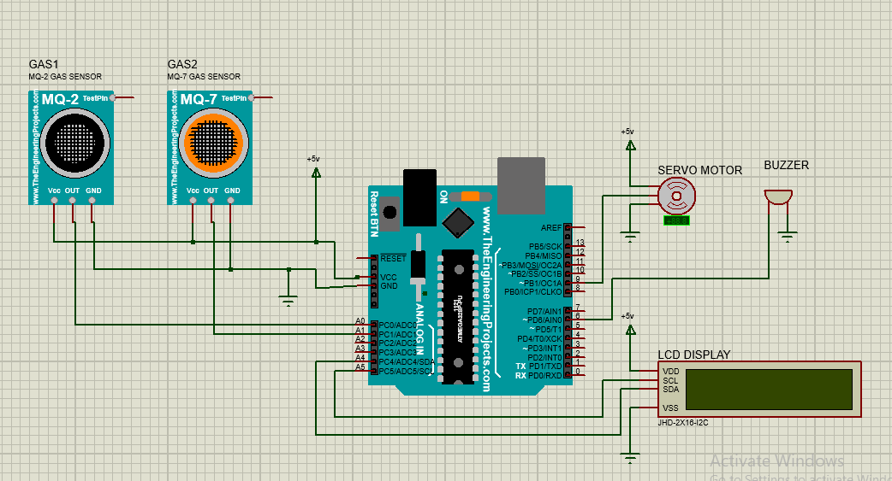

# Automatic Vehicle Ventilation System

This project is an **Automatic Vehicle Ventilation System** designed to monitor harmful gases like **carbon monoxide (CO)** and **smoke** inside a vehicle and trigger a ventilation mechanism when unsafe levels are detected. It helps improve passenger safety and air quality by automatically opening windows or doors using servo motors.

## Features

- Detects **carbon monoxide (CO)** using the **MQ-7** sensor
- Detects **smoke and other gases** using the **MQ-2** sensor
- Displays gas levels on an **LCD screen**
- Activates **SG90 servo motors** to open windows or doors when gas levels exceed thresholds
- Built using **Arduino UNO**

## Components Used

- Arduino UNO
- MQ-2 Gas Sensor (Smoke)
- MQ-7 Gas Sensor (Carbon Monoxide)
- 2x SG90 Servo Motors
- 16x2 LCD Display (with I2C or standard)
- Jumper wires and breadboard
- Power supply

## How It Works

1. **Gas Detection**: The MQ-2 and MQ-7 sensors constantly monitor the air for smoke and CO gas levels.
2. **Threshold Check**: If the gas level exceeds a predefined threshold, the system activates ventilation.
3. **Ventilation Activation**: SG90 servo motors open vehicle windows or doors to allow fresh air.
4. **Display**: Real-time gas values are shown on the LCD screen for user awareness.

## Circuit Diagram

## Code

The Arduino code reads sensor values, compares them against safe thresholds, and drives the servo motors accordingly. It also updates the LCD with gas readings.

> You can find the full code in the [Arduino_Code](ArduinoFile.ino) file.

## Installation

1. Connect the components as per the circuit diagram.
2. Upload the Arduino code using the Arduino IDE.
3. Power the system and monitor the LCD screen for readings.
4. The servo motors will automatically operate if dangerous gas levels are detected.

## Future Improvements

- Add a GSM module for SMS alerts
- Implement a mobile app or Bluetooth module for real-time monitoring
- Add a fan-based ventilation system in addition to opening windows
- Improve sensor calibration and accuracy

## License

This project is open-source and available under the MIT License.

---

**Developed by [Your Name or Team Name]**
